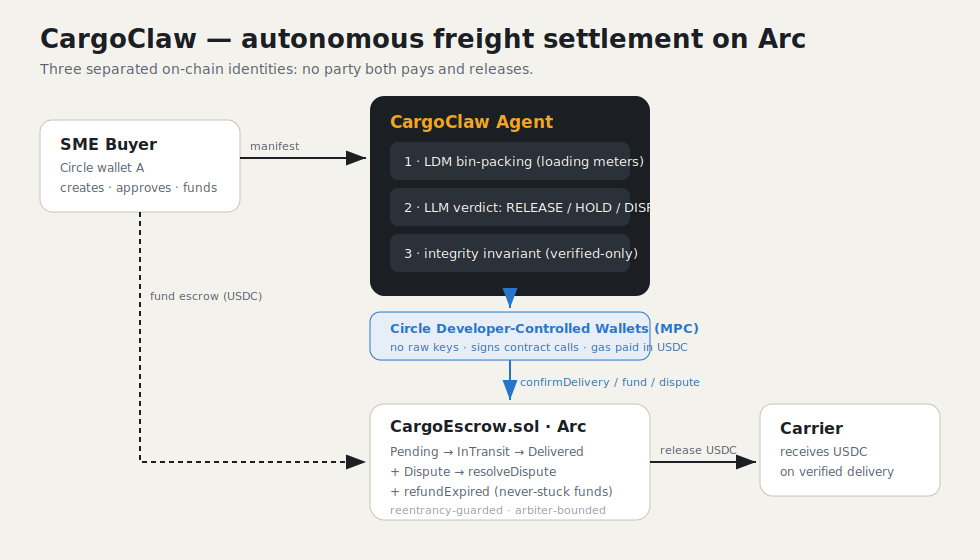

<div align="center">



# CargoClaw 🦾📦

**An autonomous agent that packs the trailer, escrows the USDC, and releases payment the moment delivery is verified.**


**Live contract:** [`0x3307CDA181bc306c6a7Be3848D46217052Aaa761`](https://testnet.arcscan.app/address/0x3307CDA181bc306c6a7Be3848D46217052Aaa761) on Arc Testnet · **Settlement tx:** [`0xe11c0ffa…8c1235`](https://testnet.arcscan.app/tx/0xe11c0ffacefdb3f850ae64b895082eb965063add45eb00f90ac7f3edf98c1235) · **Full on-chain proof →** [`docs/PROOF.md`](docs/PROOF.md)

</div>

> Most SME freight payments are stuck in a 30–90 day limbo of invoices, disputes, and follow-up emails. CargoClaw turns the whole loop into one autonomous on-chain action: the agent computes exactly how much trailer space (loading meters) a non-stackable load needs, locks the carrier's fee in a USDC escrow on Arc, and releases it automatically when verified proof-of-delivery arrives — or disputes it when the manifest doesn't match.

---

## Why

Working capital for SME logistics is bottlenecked by two manual, error-prone steps that CargoClaw automates end to end:

1. **Capacity & pricing.** Non-stackable freight (the hard, valuable kind) can't be optimised by weight alone — it's a 2D floor-packing problem measured in **loading meters (LDM)**. CargoClaw runs a real bin-packing engine to size the fleet and price the haul.
2. **Settlement.** Once goods move, payment shouldn't wait on paperwork. CargoClaw escrows USDC on Arc and an autonomous agent releases it against verified delivery — with a dispute path and a permissionless refund if delivery never happens.

## Architecture



Three on-chain identities, deliberately separated so **no single party both pays and releases**:

```
  ┌──────────────┐   manifest      ┌─────────────────────────────┐
  │  SME Buyer   │ ───────────────▶│        CargoClaw Agent      │
  │ (Circle      │                 │  ┌───────────────────────┐  │
  │  wallet A)   │   fund escrow   │  │ 1. LDM bin-packing    │  │
  └──────┬───────┘ ◀───────────────│  │ 2. LLM decision step  │  │
         │                         │  │ 3. integrity invariant│  │
         │ approve+fund            │  └───────────────────────┘  │
         ▼                         └──────────┬──────────────────┘
  ┌─────────────────────────────┐            │ confirmDelivery /
  │     CargoEscrow.sol (Arc)   │ ◀──────────┘ raiseDispute
  │  Pending→InTransit→Delivered│              (Circle wallet B = arbiter)
  │  +Dispute +refundExpired    │
  └──────────┬──────────────────┘
             │ release USDC
             ▼
      ┌──────────────┐
      │   Carrier    │
      └──────────────┘
```

The agent **never holds a raw private key**. Every signature is delegated to Circle's MPC infrastructure via a registered entity secret. On Arc, gas is paid in USDC, so a USDC-funded wallet needs no separate native token.

## Circle stack used

| Circle product | How CargoClaw uses it |
|---|---|
| **USDC** | The escrow's settlement + refund asset (6-decimals), and gas on Arc |
| **Developer-Controlled Wallets** | The agent's buyer + arbiter wallets on `ARC-TESTNET`; MPC signing for `createShipment`, `confirmDelivery`, `raiseDispute` via `createContractExecutionTransaction` |
| **Arc** | The settlement L1 — deterministic finality, USDC-denominated gas |

## Flow

1. `POST /webhook/cargo` — buyer registers a shipment. Agent runs LDM analysis, then the **buyer wallet** creates + funds the escrow.
2. `POST /webhook/deliver` — proof-of-delivery arrives. The agent **reasons** over it (LLM verdict + integrity invariant) and:
   - **RELEASE** → arbiter wallet calls `confirmDelivery`, escrow pays the carrier.
   - **DISPUTE** → arbiter calls `raiseDispute` for resolution.
   - **HOLD** → nothing on-chain until delivery is verified.

## Smart contract

```solidity
// release happens at most once; only the agent can trigger it; reentrancy-guarded
function confirmDelivery(bytes32 _shipmentId) external onlyAgent nonReentrant {
    Shipment storage s = shipments[_shipmentId];
    require(s.status == Status.InTransit, "CargoEscrow: not in transit");
    s.status = Status.Delivered;                       // effects before interaction
    require(usdcToken.transfer(s.carrier, s.amount), "CargoEscrow: settlement failed");
    emit ShipmentDelivered(_shipmentId, s.carrier, s.amount);
}

// funds are NEVER stuck: anyone can refund the sender after the deadline
function refundExpired(bytes32 _shipmentId) external nonReentrant { ... }
```

The integrity invariant lives in the agent too — it will **never** authorise an on-chain release without independently verified delivery (`pod.verified === true`), regardless of what the LLM returns.

## Tech stack

`Solidity 0.8.24` · `Node 20` · `Express` · `ethers v6` (encoding/ids) · `@circle-fin/developer-controlled-wallets` · vanilla HTML/Tailwind dashboard · OpenAI-compatible LLM endpoint (LiteLLM-ready) for the decision step.

## Local dev

```bash
git clone https://github.com/Makabeez/CargoClaw.git && cd CargoClaw/agent
cp .env.example .env            # then fill in Circle creds (see below)
npm install
npm test                        # logistics + decision-engine unit tests
node scripts/setup-wallets.js   # provisions agent + buyer wallets on Arc Testnet
npm start
```

Open `frontend/index.html` (or the Render URL) and point the API field at your agent.

### Circle setup (do this yourself — never commit secrets)

1. Create a Circle developer account and API key at <https://console.circle.com>.
2. Generate + register an **entity secret**: <https://developers.circle.com/wallets/dev-controlled/register-entity-secret>. **Store the recovery file outside this repo.**
3. Put `CIRCLE_API_KEY` and `CIRCLE_ENTITY_SECRET` in `agent/.env`.
4. `node scripts/setup-wallets.js` prints the wallet ids + addresses — fund them with Arc Testnet USDC ([faucet.circle.com](https://faucet.circle.com), select Arc Testnet).
5. Deploy the escrow (one-time, Foundry — uses a throwaway funded key, **not** the agent key):

```bash
cd ..                              # repo root
forge install foundry-rs/forge-std --no-commit
# in .env set DEPLOYER_PRIVATE_KEY (funded) and AGENT_WALLET_ADDRESS (the Circle agent wallet)
source agent/.env
forge script script/Deploy.s.sol:Deploy \
  --rpc-url "$ARC_RPC_URL" --broadcast \
  --verify --verifier sourcify
```

Paste the printed address into `ESCROW_CONTRACT_ADDRESS` in `agent/.env`.

## Deployment

- **Contract:** Foundry on Arc Testnet (chain `5042002`), verified via Sourcify. See command above.
- **Agent:** `docker compose up --build` (agent on `:4005`) or deploy `/agent` to Render.
- **Dashboard:** static file — host anywhere and pass `?api=<agent-url>`.

---

## Circle Product Feedback

**Why we chose these products.** Arc + USDC + Developer-Controlled Wallets is the smallest stack that lets an *agent* hold value and settle autonomously. Developer-Controlled Wallets were the deciding factor: an autonomous freight agent must sign transactions unattended, and doing that with a raw `ethers.Wallet` private key is exactly the anti-pattern we wanted to eliminate. MPC custody via a registered entity secret removed the single biggest security liability from the design.

**What worked well.** `createWallets({ blockchains: ["ARC-TESTNET"] })` worked first try — Arc is a first-class citizen in the SDK. The `abiFunctionSignature` + `abiParameters` form of `createContractExecutionTransaction` made our escrow calls readable and auditable without hand-encoding calldata. USDC-as-gas on Arc simplified funding: one asset covers both escrow and execution. The transaction lifecycle state machine (`INITIATED → … → COMPLETE`) is clear and easy to poll.

**What could be improved.** (1) The async transaction lifecycle means a contract call isn't confirmed synchronously — for a hackathon demo we poll `getTransaction`, but a first-class "await terminal state" helper in the SDK would remove a lot of boilerplate. (2) Entity-secret registration is the steepest part of onboarding; a guided CLI in the SDK (`npx @circle-fin/dcw register`) would help newcomers. (3) Discovering the correct USDC `tokenId`/address on Arc Testnet took a few docs hops — a single canonical testnet-addresses table would save time.

**Recommendations for a more seamless DX.** Ship an opt-in `waitForTransaction(id)` helper; bundle a `setup`-style scaffolder that does entity-secret registration + wallet-set creation + testnet faucet links in one command; and surface Arc's USDC-gas model prominently in the wallets quickstart, since it's a pleasant surprise that trips people up when they look for a native token.

---

## Attribution

Built by **Makabeez (Geiserjoe)** for the Ignyte **Stablecoins Commerce Stack Challenge**. Logistics engine, contract, agent, and dashboard are original work. Circle integration follows the official `@circle-fin/developer-controlled-wallets` SDK.

## License

MIT
